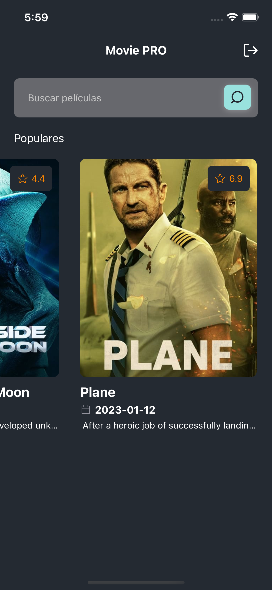
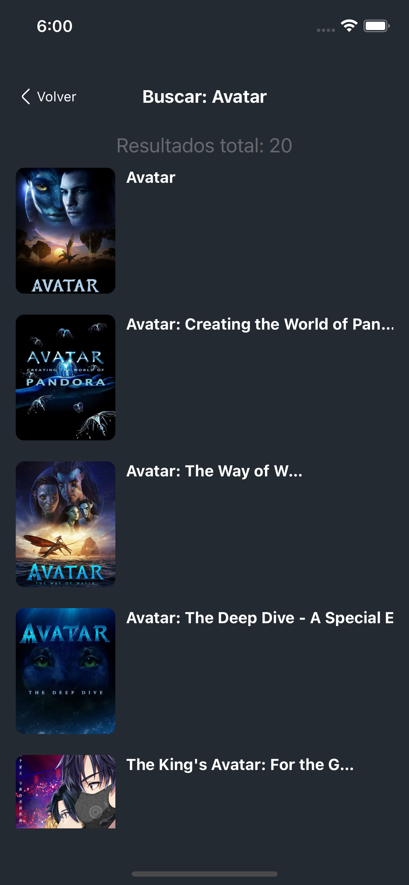

# MoviePRO

This project is a React Native app that uses the API of The Movie DB to display a list of movies, provide movie details, and allow the user to search for movies.


## Preview







# Features
Splash screen with a simple animation using Lottie
Login screen with a form that includes email and password fields, and sends a POST request to https://api.backbonechallenge.app/auth/local with the provided credentials. If the credentials are correct, the API will return a JWT token, which is stored in the local storage of the device. The user is then redirected to the home screen.
Home screen with a top bar that includes a search input and button, and a list of popular movies with the following information for each movie: title, poster, release date, overview, and average rate/vote.
Detail screen with movie details, a list of suggested/related movies, and the ability to navigate to the detail screen of any suggested/related movie.
Search screen that allows the user to search for movies by name and displays a list of matching movies, similar to the list of popular movies on the home screen.


### ENV setup

create `.env` files on the root following its respective `.env.example` templates.


---
## Available Scripts

### NPM modules

```
npm install
# or
yarn install

```

### Install Pods

```
npm run pod
#or
yarn pod

```


### `npm start`

Runs your app in development mode.

Sometimes you may need to reset or clear the React Native packager's cache. To do so, you can pass the `--reset-cache` flag to the start script:

```
npm start -- --reset-cache
# or
yarn start -- --reset-cache

```

#### `npm run ios`

Like `npm start`, but also attempts to open your app in the iOS Simulator if you're on a Mac and have it installed.

#### `npm run android`


